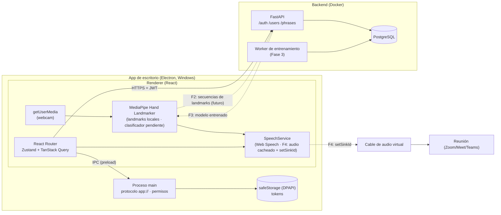

# Arquitectura de SeñaVoz

## Vista general (MVP + fases futuras)

Las líneas punteadas son fases futuras; el MVP implementa las sólidas.

## Estructura

- `backend/app/api`: routers finos (auth, users, phrases, health) → `services/` (lógica) → `db/models.py`.
- `backend/app/core`: config (pydantic-settings), seguridad (Argon2, JWT, SHA-256), dependencias (usuario actual).
- `desktop/src/main`: arranque de Electron. Protocolo `app://senavoz` (`appProtocol.ts`, resolución segura de rutas), permisos y navegación (`security.ts`), almacén de tokens cifrado (`tokenStore.ts`) y User-Agent ASCII (`userAgent.ts`). La lógica va en funciones puras con dependencias inyectadas, testeadas sin Electron.
- `desktop/src/preload`: expone con `contextBridge` solo `window.senavoz.tokens.{get, save, clear}`.
- `desktop/src/shared/ipc.ts`: contrato IPC (tipos y nombres de canal) compartido por main, preload y renderer.
- `desktop/src/renderer/src`:
  - `routes/`: pantallas y guard (`RequireAuth` / `RequireGuest` según `useSession().status`).
  - `api/`: cliente axios + interceptor.
  - `store/`: Zustand (sesión, ajustes).
  - `services/`: voz, cámara y reconocimiento, detrás de interfaces.
  - `hooks/`: atajos de teclado.
  - `ui/`: componentes.
  - `i18n/`: textos.

## Autenticación

1. `login` devuelve access (JWT, 15 min) + refresh (aleatorio opaco, 7 días).
2. El servidor guarda **solo el SHA-256** del refresh en `refresh_tokens`.
3. `refresh` **rota**: marca el token usado como `revoked_at` y `replaced_by = nuevo`.
4. Reutilizar un refresh ya revocado se interpreta como posible robo: se revocan **todos** los refresh del usuario.
5. `logout` revoca el refresh recibido (idempotente).
6. En la app, ante un 401 el interceptor hace **un único** refresh, compartido por todas las peticiones concurrentes, y reintenta. Si falla, borra los tokens y cierra la sesión.
7. Los tokens viven cifrados en el proceso main (`safeStorage`). El renderer los pide por IPC y guarda una copia en memoria. Si el cifrado del sistema no está disponible, `save` falla y la sesión no se guarda.

Los errores de login son genéricos ("Correo o contraseña incorrectos"). Cuando el email no existe, Argon2 verifica contra un hash señuelo, para no filtrar si existe ni por mensaje ni por tiempo.

## Modelo de datos

Implementado (migración `0001`): `users`, `refresh_tokens`, `phrases`.

### Tablas futuras (documentadas, **no implementadas**)

**`sign_samples`** — muestras grabadas por el usuario para entrenar (Fase 2).

| Columna    | Tipo               | Nota                                       |
| ---------- | ------------------ | ------------------------------------------ |
| id         | UUID PK            |                                            |
| user_id    | UUID FK → users    |                                            |
| phrase_id  | UUID FK → phrases  | etiqueta de la seña                        |
| landmarks  | JSON / array float | 30 × 126, normalizado respecto a la muñeca |
| created_at | timestamptz        |                                            |

**`ml_models`** — modelos entrenados por usuario (Fase 3).

| Columna    | Tipo            | Nota                                                              |
| ---------- | --------------- | ----------------------------------------------------------------- |
| id         | UUID PK         |                                                                   |
| user_id    | UUID FK → users |                                                                   |
| version    | int             | incremental por usuario                                           |
| model_path | text            | ubicación del modelo exportado (formato por decidir en la Fase 3) |
| metrics    | JSON            | accuracy, matriz de confusión, nº de muestras…                    |
| created_at | timestamptz     |                                                                   |

## Decisiones

**App de escritorio (Electron).** La app corre en el mismo PC que la videollamada. Así la voz puede ir directamente a un cable de audio virtual que la reunión usa como micrófono, sin companion ni WebSocket. Electron permite reutilizar la lógica TS del MVP móvil y ejecutar `@mediapipe/tasks-vision` (WASM/GPU) en el renderer sin código nativo. Plataforma objetivo: Windows.

**Protocolo propio `app://senavoz`.** La UI no se carga desde `file://`, cuyo origen `null` complica CORS y la CSP. `app://senavoz` da un origen estable que el backend autoriza en `CORS_ORIGINS`, y el handler solo sirve archivos dentro de la carpeta de la UI. Electron incluye el nombre de la app en el User-Agent, así que se normaliza a ASCII: con la ñ, Chromium rechaza las subpeticiones de `app://`.

**Proceso main mínimo y aislado.** Main solo gestiona ventana, protocolo, permisos (solo cámara) y tokens. Toda la lógica de producto está en el renderer, con `contextIsolation` + `sandbox`. El preload expone una API de tres funciones.

**Visión local.** MediaPipe Hand Landmarker ya detecta hasta dos manos en el renderer y produce landmarks sin enviar vídeo ni landmarks al backend. El archivo del detector y los WASM se empaquetan localmente. La clasificación de señas aún requiere un modelo entrenado y configurado; mientras no exista, la pantalla comunica que hay detección de manos, pero no activa una frase.

El artefacto de detección de manos incluido es el modelo oficial [Hand Landmarker](https://storage.googleapis.com/mediapipe-models/hand_landmarker/hand_landmarker/float16/1/hand_landmarker.task); MediaPipe lo utiliza para extraer keypoints y no para clasificar señas del catálogo.

**Entrenamiento en servidor.** Una red LSTM/GRU pequeña conviene entrenarla en lote. El servidor recibe muestras, entrena, evalúa y exporta un modelo versionado que la app descarga. Así el ciclo de mejora del modelo va separado del de publicación de la app.

**TTS pregenerado/cacheado.** Las frases son un conjunto cerrado y pequeño. Se pueden pregenerar con una voz de más calidad que la del sistema y reproducirlas localmente. `SpeechService` ya abstrae esto: hoy usa `WebSpeechService` (voces del sistema), y `CachedAudioSpeechService` ya reproduce un audio local por `code` y cae al TTS si no hay audio.

**Audio hacia la reunión.** `speechSynthesis` no permite elegir el dispositivo de salida, así que la voz del sistema no puede ir al cable virtual. En la Fase 4 se usarán audios pregenerados reproducidos con `HTMLAudioElement.setSinkId()` hacia el dispositivo virtual (VB-Cable), que la reunión usa como micrófono.

**Interfaces desacopladas.** `SignRecognizer` y `SpeechService` son el contrato entre la UI y las capacidades cambiantes. `MediaPipeSignRecognizer` implementa la detección de manos y admite un clasificador temporal opcional; la pantalla de cámara no depende directamente de MediaPipe.

## Roadmap

### Fase 2 — Captura de datos

- **Base de visión implementada:** `@mediapipe/tasks-vision` (HandLandmarker, modo VIDEO) sobre la webcam, en el renderer; modelo del detector y WASM empaquetados con la app.
- Pendiente: grabación en ráfaga con cuenta atrás (3‑2‑1, 30 frames, pausa, repetir hasta N muestras por frase).
- Secuencias de **30 frames × 126 valores** (2 manos × 21 puntos × xyz), normalizadas respecto a la muñeca (mano ausente → ceros). La normalización TypeScript pura y la ventana temporal ya están implementadas.
- Subida al backend: `POST /samples` → tabla `sign_samples`.

### Fase 3 — Entrenamiento e inferencia

- Pendiente: entrenar/validar un modelo de señas y configurar mapeo de etiquetas a códigos de frase. El adaptador de clasificador aplica umbral y cooldown, pero no hay pesos incluidos todavía.
- Worker de entrenamiento (LSTM/GRU pequeña) por usuario, con clase **"neutral"** para el reposo, umbral de confianza y _cooldown_ entre detecciones para evitar repeticiones.
- Registro en `ml_models` y endpoint de descarga.
- Inferencia en el renderer implementando `SignRecognizer` sin tocar la UI. **Dirección, no decisión:** TF.js u ONNX Runtime Web.

### Fase 4 — Voz hacia la reunión

- Audios pregenerados/cacheados por frase.
- Selección del dispositivo de salida (`setSinkId`) hacia el cable de audio virtual enrutado como micrófono de la reunión.
