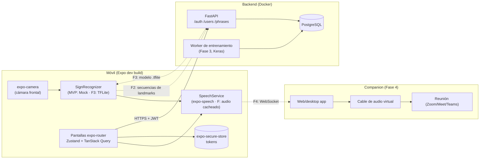

# Arquitectura de SeñaVoz

## Vista general (MVP + fases futuras)

Las líneas punteadas son fases futuras; el MVP implementa las sólidas.

## Estructura

- `backend/app/api` routers finos (auth, users, phrases, health) → `services/` (lógica) → `db/models.py`.
- `backend/app/core` config (pydantic-settings), seguridad (Argon2, JWT, SHA-256), dependencias (usuario actual).
- `mobile/src/app` rutas expo-router: `(auth)/login|register`, `(app)/home|camera|settings`. El guard de rutas (`Stack.Protected`) depende de `useSession().status`.
- `mobile/src/api` cliente axios + interceptor; `mobile/src/store` Zustand; `mobile/src/services` abstracciones futuras.

## Autenticación

1. `login` devuelve access (JWT, 15 min) + refresh (aleatorio opaco, 7 días).
2. El servidor guarda **solo el SHA-256** del refresh en `refresh_tokens`.
3. `refresh` **rota**: marca el token usado como `revoked_at` y `replaced_by = nuevo`.
4. Reutilizar un refresh ya revocado se interpreta como posible robo: se revocan **todos** los refresh del usuario.
5. `logout` revoca el refresh recibido (idempotente).
6. En el móvil, el interceptor ante un 401 hace **un único** refresh compartido por todas las peticiones concurrentes y reintenta; si falla, limpia el almacén seguro y cierra la sesión.

Errores de login genéricos ("Correo o contraseña incorrectos") y verificación Argon2 contra un hash señuelo cuando el email no existe, para no filtrar existencia por mensaje ni por tiempo.

## Modelo de datos

Implementado (migración `0001`): `users`, `refresh_tokens`, `phrases`.

### Tablas futuras (documentadas, **no implementadas**)

**`sign_samples`** — muestras grabadas por el usuario para entrenar (Fase 2).

| Columna | Tipo | Nota |
|---|---|---|
| id | UUID PK | |
| user_id | UUID FK → users | |
| phrase_id | UUID FK → phrases | etiqueta de la seña |
| landmarks | JSON / array float | 30 × 126, normalizado respecto a la muñeca |
| created_at | timestamptz | |

**`ml_models`** — modelos entrenados por usuario (Fase 3).

| Columna | Tipo | Nota |
|---|---|---|
| id | UUID PK | |
| user_id | UUID FK → users | |
| version | int | incremental por usuario |
| tflite_path | text | ubicación del `.tflite` (disco/objeto) |
| metrics | JSON | accuracy, matriz de confusión, nº de muestras… |
| created_at | timestamptz | |

## Decisiones

**Inferencia on-device.** El reconocimiento corre en el teléfono (MediaPipe + TFLite). Latencia baja y predecible para conversación en vivo, funciona sin red, y el vídeo del usuario nunca sale del dispositivo (solo se suben landmarks numéricos, y solo en la fase de grabación de muestras).

**Entrenamiento en servidor.** Entrenar una red LSTM/GRU pequeña es costoso para un móvil y conviene en batch; el servidor recibe muestras, entrena, evalúa y exporta un `.tflite` versionado que el móvil descarga. Separa el ciclo de mejora del ciclo de publicación de la app.

**TTS pregenerado/cacheado.** Las frases son un conjunto cerrado y pequeño; se pueden pregenerar con una voz de mayor calidad que la del sistema, descargarlas una vez y reproducirlas localmente (latencia mínima, sin red, voz consistente). `SpeechService` ya abstrae esto: hoy `ExpoSpeechService` (TTS del dispositivo); `CachedAudioSpeechService` ya reproduce un audio local por `code` con `expo-audio` y cae al TTS si no hay audio. Falta solo el pipeline de generación/descarga.

**Audio hacia la reunión.** Un teléfono no puede inyectar audio en el micrófono de una app de videollamada. Se resuelve en la Fase 4 con un companion en el PC: el móvil envía la frase por WebSocket, el companion la reproduce en un dispositivo de audio virtual (VB‑Cable / BlackHole / PulseAudio null-sink) que la reunión usa como micrófono.

**Interfaces desacopladas.** `SignRecognizer` y `SpeechService` son el contrato entre la UI y las capacidades cambiantes. `MockSignRecognizer` demuestra el flujo seña → voz sin ML; la pantalla de cámara solo conoce la interfaz.

## Roadmap

### Fase 2 — Captura de datos
- MediaPipe Hand Landmarker en vivo sobre la cámara.
- Grabación de secuencias de **30 frames × 126 valores** (2 manos × 21 puntos × xyz), normalizadas respecto a la muñeca (mano ausente → ceros).
- Subida al backend: `POST /samples` → tabla `sign_samples`.
- Evaluar `react-native-vision-camera` + frame processors si `expo-camera` no da acceso a frames.

### Fase 3 — Entrenamiento e inferencia
- Worker Keras (LSTM/GRU pequeña) por usuario, con clase **"neutral"** para el reposo, umbral de confianza y *cooldown* entre detecciones para evitar repeticiones.
- Exportación a TFLite, registro en `ml_models`, endpoint de descarga.
- `TfliteSignRecognizer` con `react-native-fast-tflite`, implementando `SignRecognizer` sin tocar la UI.

### Fase 4 — Voz hacia la reunión
- Companion web/desktop conectado por WebSocket al móvil.
- Reproducción por cable de audio virtual enrutado como micrófono de la reunión.
- Audios pregenerados/cacheados para baja latencia.
